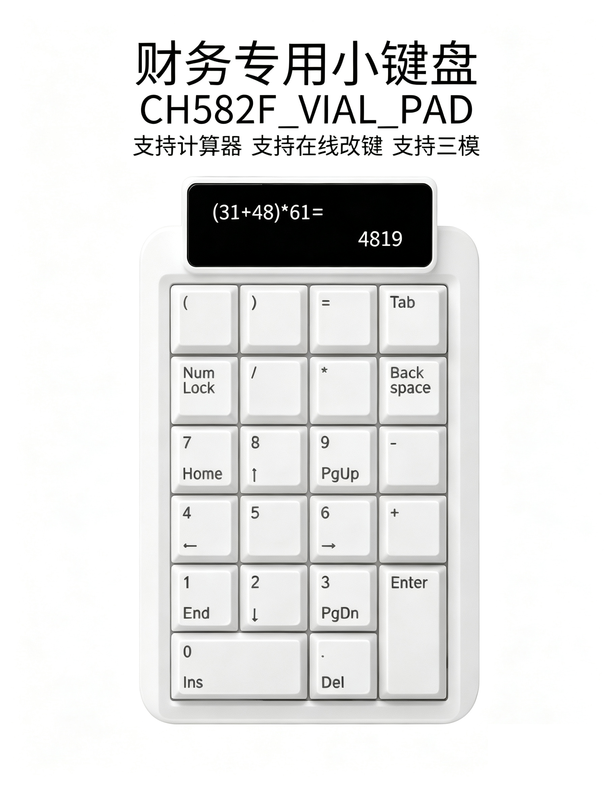

# CH582_VIAL_PAD — 财务专用三模数字小键盘

[](LICENSE)

基于 WCH CH582F 的财务专用数字小键盘固件，支持三模（USB 有线 / 蓝牙 BLE / 2.4G 无线），使用 VIAL 进行键值配置。工程由 MounRiver Studio 生成与管理。

- **参考工程**：[基于CH582M的三模兼容VIAL改键小键盘](https://oshwhub.com/bluetooth-keyboard-squad/the-first-stop-of-the-three-mode-keyboard)
- **目标芯片**：CH582F（CH582/CH583 系列，SFR 与 startup 共用 CH583 资源）
- **开发环境**：MounRiver Studio（RISC-V GCC 工具链，`riscv-none-embed-`）

<p align="center">
  
</p>

---

## 一、移植完成情况（2026-07-28）

已将参考工程 `CH582_VIAL_KBD` 的三模键盘代码完整移植到本工程，保持标准 MounRiver Studio 工程结构（真实文件夹，非 Eclipse 链接资源）。

### 1.1 目录结构

```
CH582_VIAL_PAD/
├── .project                          # Eclipse 工程描述
├── .cproject                         # 构建配置：工具链 / Include 路径 / 宏 / 库 / 源路径
├── .template                         # MounRiver 模板标记
├── .mrs/
│   └── CH582_VIAL_PAD.mrs-workspace  # MounRiver 工作区
├── CH582_VIAL_PAD.wvproj             # MounRiver 工程文件
├── CH582_VIAL_PAD.launch             # OpenOCD 调试启动配置
├── README.md
│
├── Ld/
│   └── Link.ld                       # 链接脚本（FLASH 448K / RAM 32K）
├── Startup/
│   └── startup_CH583.S               # 启动代码、中断向量表、复位处理
├── RVMSIS/
│   ├── core_riscv.c
│   └── core_riscv.h                  # RISC-V 内核接口（中断 / CSR / 原子操作）
│
├── StdPeriphDriver/                  # WCH 片上外设驱动（SDK，已与 KBD 对齐）
│   ├── libISP583.a                   # ISP 在线烧录库（链接 -lISP583）
│   ├── CH58x_clk.c                   # 时钟
│   ├── CH58x_gpio.c                  # GPIO
│   ├── CH58x_pwr.c                   # 电源管理
│   ├── CH58x_sys.c                   # 系统
│   ├── CH58x_flash.c                 # Flash 读写
│   ├── CH58x_uart0.c ~ uart3.c       # UART0~3
│   ├── CH58x_spi0.c / spi1.c         # SPI
│   ├── CH58x_i2c.c                   # I2C
│   ├── CH58x_pwm.c                   # PWM
│   ├── CH58x_adc.c                   # ADC
│   ├── CH58x_timer0.c ~ timer3.c     # 定时器（timer2→WS2812，timer3→USB）
│   ├── CH58x_usbdev.c                # USB 设备（HID）
│   ├── CH58x_usbhostBase.c / Class.c # USB 主机
│   ├── CH58x_usb2dev.c / usb2host*.c # USB2.0
│   └── inc/                          # 头文件：CH583SFR.h、CH58x_common.h、CH58x_clk.h ...
│
├── LIB/                              # BLE 协议栈库
│   ├── LIBCH58xBLE.a                 # BLE 库（链接 -lCH58xBLE）
│   ├── CH58xBLE_ROM.h                # ROM 版接口声明
│   ├── CH58xBLE_LIB.h                # LIB 版接口声明
│   ├── CH58xBLE_ROM.hex              # BLE ROM 固件
│   └── CH58xBLE_ROMx.hex
│
├── HAL/                              # 硬件抽象层
│   ├── MCU.c                         # CH58X_BLEInit / HAL_Init / 校准
│   ├── scan_key.c                    # 矩阵扫描、按键读取、模式切换键检测
│   ├── ws2812b.c                     # WS2812 RGB 灯效（TMR2 PWM + DMA）
│   ├── RTC.c                         # RTC
│   ├── SLEEP.c                       # 低功耗睡眠
│   ├── KEY.c / LED.c                 # 按键 / LED（当前未参与编译）
│   └── include/
│       ├── config.h                  # BLE 参数（MAC/DCDC/SLEEP/SNV/连接数...）
│       ├── HAL.h                     # HAL 总头文件
│       ├── scan_key.h                # 矩阵行列引脚定义、按键缓冲
│       └── ws2812.h / RTC.h / SLEEP.h / KEY.h / LED.h
│
├── Profile/                          # BLE GATT 服务
│   ├── hidkbdservice.c               # HID 键盘服务
│   ├── hiddev.c                      # HID 设备通用逻辑
│   ├── battservice.c                 # 电池服务
│   ├── devinfoservice.c              # 设备信息服务
│   ├── scanparamservice.c            # 扫描参数服务
│   └── include/                      # 上述各服务头文件
│
├── APP/                              # 应用层
│   ├── hidkbd_main.c                 # main()：vial_init() 读模式 → USB/BLE/RF
│   ├── USB_MODE.c                    # USB HID 模式（用 TMR3）
│   ├── BLE_MODE.c                    # 蓝牙 BLE 模式
│   ├── RF_MODE.c                     # 2.4G 无线模式
│   ├── libVIAL.a                     # VIAL 配置库（链接 -lVIAL）
│   └── include/
│       ├── hidkbd.h                  # HID 键盘任务接口
│       └── USB_MODE.h / RF_MODE.h / VIAL.h
│
└── obj/                              # 构建输出（自动生成，勿手动改）
    └── makefile / subdir.mk / *.o / *.d / *.elf / *.hex / *.map / *.lst
```

> 各目录文件数：StdPeriphDriver 41、HAL 15、Profile 10、APP 9、LIB 5、RVMSIS 2、Startup 1、Ld 1。

### 1.2 `.cproject` 构建配置改动（5 处）

与 KBD 已验证可编译的配置保持一致：

- **Include 路径 (-I)**：`Startup`、`APP/include`、`Profile/include`、`StdPeriphDriver/inc`、`HAL/include`、`Ld`、`LIB`、`RVMSIS`
- **宏定义 (-D)**：`DEBUG=1`、`HAL_SLEEP=1`（启用低功耗睡眠）
- **库搜索路径 (-L)**：`../`、`../LIB`、`../APP`、`../StdPeriphDriver`
- **链接库 (-l)**：`ISP583` → `VIAL` → `CH58xBLE`
- **sourceEntries**：显式列出 `APP`、`HAL`(排除 `KEY.c`/`LED.c`)、`LIB`、`Ld`、`Profile`、`RVMSIS`、`Startup`、`StdPeriphDriver`(全量编译，不排除任何 `CH58x_*.c`)

> 注：KBD 参考工程的 `.cproject` 在 StdPeriphDriver 排除列表里误排了 `CH58x_timer2.c`/`CH58x_timer3.c`，而 `ws2812b.c` 的 `TMR2_PWMInit`、`USB_MODE.c` 的 `TMR3_TimerInit` 正是由这两个文件提供，会导致链接报 `undefined reference`。本工程已去掉该排除项，全量编译所有 CH58x 驱动文件（未用函数由 `--gc-sections` 自动裁剪）。

### 1.3 关键决策

1. **覆盖 PAD 模板 SDK**：两套 SDK 有 12 个文件不同（`CH583SFR.h`、`CH58x_common.h`、`startup_CH583.S`、`core_riscv.h` 等）。因 `LIBCH58xBLE.a`/`libVIAL.a` 是按 KBD 的 SDK 预编译的，使用 KBD 的 SDK 才能保证 ABI 一致、链接通过。已校验所有 `.a` 库与差异文件 MD5 与 KBD 完全一致。
2. **删除模板 `src/Main.c`**：原 UART 回显例程与 `APP/hidkbd_main.c` 中的 `main()` 冲突，必须移除。
3. **未改动** `.project` / `.launch` / `.wvproj`：`.launch` 仍指向 `obj\CH582_VIAL_PAD.elf`，调试配置有效。

---

## 二、构建与烧录

1. MounRiver Studio 打开本工程。
2. **刷新工程（F5）→ Project > Clean → Build**（`obj/` 已清空，会全量重编）。
3. 产物：`obj/CH582_VIAL_PAD.elf` / `.hex` / `.map`（USB ISP 烧录还需 `.bin`，生成方法见第六节 6.5）。
4. 硬件 Debug：使用 `.launch` 配置（OpenOCD + WCH-RISCV 调试器），SVD 为 `CH58Xxx.svd`。

> 若链接报 `undefined reference to TMR2_PWMInit / TMR3_TimerInit` 等 SDK 函数，原因是 StdPeriphDriver 排除列表误排了对应 `.c` 文件，确认该 entry 无 `excluding` 即可。
> 若报其它 `undefined reference`（库之间循环依赖），可将三个库包进 `-Wl,--start-group ... -end-group`。

---

## 三、三模切换逻辑

上电后 `main()`（`APP/hidkbd_main.c`）直接从 EEPROM `0x3F00` 硬件读取模式字节（跳过 `vial_init()`——其在空 flash 下会死循环，详见 6.3），按值进入对应模式：

| 模式字节 | 模式 | 初始化流程 |
|---|---|---|
| `0x0B` | USB 有线 | `USB_INIT()` |
| `0xBE` | 蓝牙 BLE | `CH58X_BLEInit()` → `HAL_Init()` → `GAPRole_PeripheralInit()` → `HidDev_Init()` → `HidEmu_Init()` |
| `0x24` | 2.4G 无线 | `CH58X_BLEInit()` → `HAL_Init()` → `RF_RoleInit()` → `RF_Init()` |
| 其它 | 复位 | `SYS_ResetExecute()` |

模式切换通过长按三个切换键触发：键值表 `key_data_buf[1][0/1/2]` 分别对应 USB/BLE/2.4G，长按约 2s 写入 `0x0B/0xBE/0x24` 到 flash 后复位生效。`USB_MODE.c`/`BLE_MODE.c`/`RF_MODE.c` 三个模式均实现了向另外两模式的切换，三模可互切（计数器 `change_mode_USB/BLE/24` 在 `HAL/scan_key.c`）。切换键需先用 VIAL 配到键值表里才能触发（否则 keycode 为 `0xFF`）。
另外 `GPIOA_IRQHandler` 监听 PA5 下降沿作为硬件强制复位按键。

---

## 四、后期改数字小键盘的计划（待办）

当前代码是参考工程的**全键盘**实现，需按财务小键盘的实际硬件裁剪。以下为后续工作清单：

### 4.1 矩阵适配（高优先）
- 文件：`HAL/include/scan_key.h`、`HAL/scan_key.c`
- 现状：5 行 × 4 列（行在 PA：PA1/2/3/15/14/13，列在 PB：PB0~PB7），`key_data_buf[5][4]`
- 待办：按小键盘 PCB 实际行列数与引脚改 `row_x`/`col_x` 宏、`row_all`/`col_all`、`key_data_buf` 维度、`Scan_init()`/`get_key()` 扫描逻辑。

### 4.2 HID 描述符与键值表（高优先）
- 文件：`APP/USB_MODE.c`（USB HID）、`APP/BLE_MODE.c`（BLE HID）
- 待办：报告描述符改为数字小键盘（Keyboard + Numpad）；键值表映射改为小键盘按键（0~9、+、-、*、/、Enter、.、NumLock 等）；财务场景可能需要的组合键/宏。

### 4.3 模式切换组合键
- 文件：`HAL/scan_key.c`（`find_mode_changekey`、`change_mode_*`）
- 待办：按小键盘可用按键重新定义 USB/BLE/2.4G 切换组合键。

### 4.4 VIAL 键值配置
- `libVIAL.a` 为预编译库，VIAL 协议与键位存储在 flash。
- 待办：用 VIAL 配置工具生成小键盘布局并写入；`vial_init()` 已跳过（见 6.3），键值表由 `EEPROM_READ` + `FLASH_DATA_VIAL_WITE_mode` 管理。

### 4.5 RGB 灯效
- 文件：`HAL/ws2812b.c`、`HAL/include/ws2812.h`
- 待办：若小键盘硬件无 WS2812 灯，需裁掉 `Ws2812_Init()`/`process_RGB_to_pwm()`/`PWM_DATA_DMA_send()` 相关调用，释放 PWM/DMA 资源。

### 4.6 硬件引脚核对
- `hidkbd_main.c` 中 PA5 复位按键、调试串口 TXD1（PA9）等引脚需与小键盘原理图核对。
- `HAL_SLEEP=1` 下上电会将 PA/PB 全部配为上拉输入，确认睡眠唤醒引脚（扫描列/模式键）配置正确。

### 4.7 低功耗与电池（若需）
- `DCDC_ENABLE`、`HAL_SLEEP`、`BLE_SNV` 等参数在 `HAL/include/config.h`。
- 待办：按电池供电需求调整睡眠参数、RTC 唤醒时间、电池电量上报（`Profile/battservice.c`）。

### 4.8 屏幕与计算器功能（远期规划）

#### 4.8.1 屏幕驱动

- **型号**：2.25 寸 SPI 屏，ST7789 驱动，76×284 分辨率
- **待办**：实现 SPI 初始化、画点/画字符/清屏/缓冲区管理等基础驱动；按屏幕分辨率（竖屏）设计 UI 布局
- **引脚**：确认 CH582 空闲 SPI 引脚（CS/DC/SCLK/MOSI/RST）与屏幕接线

#### 4.8.2 计算器功能

- 在小键盘模式和计算器模式之间切换（可用按键或组合键触发）
- 计算器模式下：按键输入数字和运算符，屏幕显示运算过程和结果
- 切换回小键盘模式：恢复正常按键输出
- **待办**：实现计算器状态机（数字输入、运算符、运算逻辑、清零/退格）
- **待办**：设计屏幕 UI 布局（76×284 竖屏，上部分显示区、下部分按键提示区）

#### 4.8.3 模式切换

- 计算器 ↔ 小键盘两种模式互切
- 模式切换时不改变 USB/BLE/2.4G 三模状态
- 计算器模式下的按键不触发 HID 键值上报

---

## 五、参考资源

- oshwhub 原项目：[基于CH582M的三模兼容VIAL改键小键盘](https://oshwhub.com/bluetooth-keyboard-squad/the-first-stop-of-the-three-mode-keyboard)
- WCH 官网：http://www.wch.cn （CH582 数据手册、MounRiver Studio、BLE 库说明）

---

## 六、调试记录（2026-07-29 ~ 2026-07-30）：USB 枚举 / VIAL 启动 / 标准 Vial 协议实现 / 三模切换

### 6.1 问题现象

固件烧录到 **WeAct WCH-BLE-Core 核心板**（CH582F）后，连接电脑无任何反应，无法枚举为 USB 设备。排查发现两个独立根因。

### 6.2 根因一：USB 控制器用错（USB2 → USB1）

**板子硬件**（WeAct WCH-BLE-Core，原理图 `HDK/WeAct-CH57xCH58xCoreBoard_V10_SchDoc.pdf`）：

- USB 座子 DP1 = **PB11**、DN1 = **PB10**，对应 CH582 的 **USB1**（UD+/UD-）。
- CH582 的 **USB2**（U2D+/U2D-）在 PB13/PB12，是另一组独立引脚，板子上未接。

**原固件**：`APP/USB_MODE.c` 全程使用 **USB2** 控制器（`R8_USB2_*` / `USB2_DeviceInit` / `USB2_IRQHandler` / `pU2EP*`），D+/D- 拉在 PB12/PB13，与板子 USB 座子（PB10/PB11）物理不通，故永远无法枚举。

**修复**：把 `APP/USB_MODE.c` 从 USB2 整体移植到 USB1。CH582 两套 USB 控制器引脚固定、不可软件重映射，只能改代码。共 43 处符号替换：

| 类别 | USB2（原） | USB1（改后） |
|---|---|---|
| 寄存器 | `R8_USB2_INT_FG/ST/EN`、`R8_USB2_DEV_AD`、`R8_USB2_RX_LEN`、`R8_USB2_MIS_ST` | `R8_USB_INT_FG/ST/EN`、`R8_USB_DEV_AD`、`R8_USB_RX_LEN`、`R8_USB_MIS_ST` |
| 端点寄存器 | `R8_U2EPx_CTRL`、`R8_U2EPx_T_LEN`、`R8_U2DEV_CTRL` | `R8_UEPx_CTRL`、`R8_UEPx_T_LEN`、`R8_UDEV_CTRL` |
| 缓冲区指针 | `pU2EP*_RAM_Addr`、`pU2EP*_DataBuf`、`pU2SetupReqPak` | `pEP*_RAM_Addr`、`pEP*_DataBuf`、`pSetupReqPak` |
| 上拉 | `RB_PIN_USB2_DP_PU` | `RB_PIN_USB_DP_PU` |
| SDK 函数 | `USB2_DeviceInit`、`U2DevEPx_IN_Deal` | `USB_DeviceInit`、`DevEPx_IN_Deal` |
| 应用函数 | `USB2_DevTransProcess`、`U2DevEPx_OUT_Deal` | `USB_DevTransProcess`、`DevEPx_OUT_Deal` |
| 中断 | `USB2_IRQHandler`、`USB2_IRQn` | `USB_IRQHandler`、`USB_IRQn`（startup 中 USB1 向量名即 `USB_IRQHandler`） |

> USB1 的 SDK（`CH58x_usbdev.c`）只提供 `USB_DeviceInit` 与 `DevEPx_IN_Deal`；`USB_DevTransProcess`、`DevEPx_OUT_Deal` 由应用层实现，移植后与头文件声明一致，无链接冲突。
> 移植后 USB1 的 D+/D- 落在 PB10/PB11，与板子 USB 座子一致。Bus Hound 抓包确认设备/配置/字符串描述符均正确返回，`SET CONFIG` 完成，枚举正常。

### 6.3 根因二：`vial_init()` 在空 flash 下卡死

- **现象**：USB1 修复后，若恢复原始 `vial_init()` 流程，又无法枚举。
- **原因**：USB ISP 烧录会整片擦除 flash，vial 数据区为空（0xFF）。`vial_init()`（在预编译库 `APP/libVIAL.a` 中）对空 flash 做校验，**校验失败时内部卡死/复位、不返回**——已验证：即便加 `if(非法模式) key_mode=0x0B` 兜底仍枚举不了，说明它根本没走到返回。
- **关键推理**：原工程切 BLE/2.4G 时（`USB_MODE.c` 的 `TMR3_IRQHandler`）就是用 `FLASH_DATA_VIAL_WITE_mode({0xBE/0x24})` 写模式后复位，下次开机 `vial_init()` 能读到该模式并进入对应模式。说明 **`FLASH_DATA_VIAL_WITE_mode` 写入的模式是 `vial_init()` 能识别的合法模式**。

**修复**（`APP/hidkbd_main.c` 的 `main()`）：彻底不调 `vial_init()`（其在空 flash 下校验 `0x3E00`/`0x7F018` 失败后死循环，与 mode 是否写入无关）。改为手动设 `vial_key_done=1` 使所有 vial 库读写函数可用，模式字节直接从 EEPROM `0x3F00` 硬件读。三模切换写入的 BLE/2.4G 不会被覆盖，且空 flash 首次启动也能枚举：

```c
// vial_init() 在空 flash 下校验失败会死循环，故彻底不调。
// 手动设 vial_key_done=1，所有 vial 库函数可用；模式直接从 EEPROM 读。
extern uint8_t vial_key_done;
vial_key_done = 1;
{
    uint8_t mode;
    EEPROM_READ(0x3F00, &mode, 1);            // 直接硬件读，空 flash 返回 0xFF
    if (mode != 0x0B && mode != 0xBE && mode != 0x24) {
        mode = 0x0B;                           // 非法 → 默认 USB
        FLASH_DATA_VIAL_WITE_mode(&mode);
    }
    key_mode = mode;
}
if (key_mode != 0x0B && key_mode != 0xBE && key_mode != 0x24) {
    key_mode = 0x0B;                           // 兜底
}
```

修复后首次上电即可枚举，可用 VIAL 上位机在线配置 flash 键值表。✅ **2026-07-29 已烧录测试通过，USB 枚举正常。**

### 6.4 已知行为 / 副作用

- **跳过 `vial_init()` + 手动设 `vial_key_done=1`**：`vial_init()` 在空 flash 下校验 `0x3E00`/`0x7F018` 失败后死循环，与 mode 字节无关。故彻底不调它，改为手动设 `vial_key_done=1`（使 `FLASH_DATA_VIAL_WITE_mode`/`FLASH_DATA_KEY` 等所有 vial 库函数可用），模式直接从 EEPROM `0x3F00` 硬件读。非法时写 `0x0B`（首次上电默认 USB），合法时保留（三模切换写入的 BLE/2.4G 不会被覆盖）。✅ **已测试验证：空 flash 首次上电可枚举，三模切换后模式持久化正常。**
- **核心板无按键矩阵**：WeAct 核心板是裸 MCU，没有矩阵，故枚举后按键无输出属正常；接上小键盘矩阵（见第四节 4.1）后才会有键值。
- **键值表持久化**：键值表配置后，开机不再写 `0x0B`（仅空 flash 才写），故不会擦键值表。仍建议用 VIAL 上位机写一次键位后断电重启确认键位在。

### 6.5 `.bin` 生成（USB ISP 烧录用）

工程默认 `Create flash image` 输出格式为 **ihex**（`.hex`），见 `.cproject` 的 `createflash.choice`。用 WCHISPTool 做 USB ISP 烧录需要 `.bin`，二选一：

- **GUI**：Project → Properties → C/C++ Build → Settings → Build Steps → `Create flash image` 的 `Output file format (-O)` 改为 `binary`，重新 Build 即产出 `obj/CH582_VIAL_PAD.bin`。
- **命令行**：编译出 `.elf` 后用工具链转换 `riscv-none-embed-objcopy -O binary obj/CH582_VIAL_PAD.elf obj/CH582_VIAL_PAD.bin`。

> 烧录时 `.bin` 起始地址为 `0x0000`（应用区起始）。ISP 烧录会整片擦除 flash（含 vial 数据区），故每次 ISP 烧录后均为"空 flash 冷启动"，由 6.3 的修复保证仍能枚举。

### 6.6 根因三：vial.rocks 无法识别（固件为自定义 Vial 协议，非标准 Vial）

- **现象**：USB 枚举正常、vial.rocks 也能 WebUSB 配对，但连接后提示 "No devices detected"，无法显示布局/改键。
- **根因**：`APP/USB_MODE.c` 的 `DevEP3_OUT_Deal`（VIAL 端点处理）是**自定义协议**，不是标准 Vial 协议：
  - 只处理 `0x01`（开始批量传输）、`0x05`（设键）、`0x12`（读键值页），其余命令**原样回显**。
  - 标准 Vial 连接后首发 `get_keyboard_id(0x00)` / `get_size(0x01)` / `get_def(0x02)` 均未实现（`0x00` 被回显、`0x01` 被当作"开始传输"、`0x02` 未作定义读取），vial.rocks 拿不到键盘 UID/定义，判定非合法 Vial 键盘。
  - HID 描述符（usage page `0xFF60`、32B in/out）是标准 Vial 的，故 WebUSB 能配对；但协议层握手失败。
- **非移植丢失**：对比 KBD 参考工程，其 `U2DevEP3_OUT_Deal` 与本工程完全相同，全工程无任何标准 Vial 标识（`keyboard_definition` / `VIAL_KEYBOARD_UID` / `vial_get_keyboard` 等均无）。即 KBD 原工程用的也是自定义协议，vial.rocks 对它同样不适用。
- **自定义协议摘要**（供后续实现参考）：
  - `0x12`（offset 0 / 0x1c）：读键值表两页，返回 `key_data_buf`
  - `0x05` `[05,layer,row,col,mode,keycode]`：设单个键，写 `key_data_buf` 并存 flash（`Debonding_layer_cfg`）
  - `0x01` + 77 包 × 32B：批量读写 vial data flash

- **已修复（2026-07-30）**：✅ 已将 `DevEP3_OUT_Deal` 重写为标准 VIA/Vial 协议，内嵌 LZMA 压缩键盘定义，详见 6.8 节。`libVIAL.a` 只提供 flash 存储，不含 Vial 协议。

### 6.7 三模互切补全：USB 切换键

- **现象**：原 `USB_MODE.c` 的 `TMR3_IRQHandler` 中，`key_data_buf[1][0]`（USB 切换键）只有 `//USB MODE` 注释、**没有写 `0x0B` 的逻辑**，导致 USB 模式下无法切回 USB（BLE/2.4G 切换键正常）。`BLE_MODE.c` / `RF_MODE.c` 本就有 USB 切换（写 `0x0B`）。
- **修复**（`APP/USB_MODE.c` 的 `TMR3_IRQHandler`）：给 USB 切换键补上 `change_mode_USB++`，并加 `if (change_mode_USB == 1500)` 写 `0x0B` 后复位（与 BLE/2.4G 同阈值 ~2.25s）；两处计数器复位同步加 `change_mode_USB = 0`。
- **配合 6.3**：因 6.3 已改为"仅空 flash 写 `0x0B`"，三模切换写入的模式不会被开机覆盖，三模可互相切换且断电保持。切换键需先用 VIAL 配到键值表 `key_data_buf[1][0/1/2]` 才能触发（否则 keycode 为 `0xFF`）。

### 6.8 标准 Vial 协议实现与调试（2026-07-30）

将自定义协议重写为标准 VIA/Vial 协议，使 Vial 桌面应用可识别。以下是调试过程中遇到的所有问题及修复。

#### 6.8.1 协议架构

标准 Vial 协议通过 raw HID 接口（usage page `0xFF60`，EP2 IN / EP3 OUT，32 byte/包）通信：

- **VIA 命令**（byte 0 = 0x01–0x0D）：协议版本、键值读写、宏、灯光等
- **Vial 命令**（byte 0 = `0xFE`，byte 1 = 子命令 0x00–0x0D）：键盘识别、定义传输、解锁、QMK 设置等

每个命令收到后**必须在同一中断内**将 32 字节响应写入 `pEP2_IN_DataBuf` 并调用 `DevEP2_IN_Deal(32)`。

#### 6.8.2 VIA 协议版本字节序（大端序）

- **问题**：Vial 桌面版连接后提示 `Unsupported protocol version!`
- **根因**：VIA 协议用**大端序**存储 16-bit 版本号。QMK 实现为 `msg[1]=hi, msg[2]=lo`。本工程写成了小端序 `msg[1]=lo, msg[2]=hi`，桌面版读到版本 `0x0900` (2304) 而非 `0x0009` (9)。
- **修复**：`APP/USB_MODE.c` `VIA_GET_PROTOCOL_VERSION` 处理中交换 bytes 1/2 顺序。

#### 6.8.3 Vial 响应格式：有无 0xFE 前缀

参考 Vial 固件源码（`quantum/vial.c`）后发现不同命令的响应格式不同：

| 命令 | 响应格式 |
|---|---|
| `GET_KEYBOARD_ID` (0x00) | `[0xFE, 0x00, pv(4B LE), uid(8B), flags]` — **保留前缀**，数据从 msg[2] 开始 |
| `GET_SIZE` (0x01) | `[0xFE, 0x01, sz(4B LE)]` — **保留前缀**，数据从 msg[2] 开始 |
| `GET_DEFINITION` (0x02) | `[def_data…]` — **无前缀**，直接覆盖 msg[0..31] |
| 其他 Vial 命令 | **保留前缀**，数据从 msg[2] 开始 |

- **修复**：除 `GET_DEFINITION` 直接覆写整个缓冲区外，其他 Vial 命令保留 0xFE 前缀和命令字节。

#### 6.8.4 GET_DEFINITION 页面索引格式

- **问题**：定义数据解压失败 `LZMAError: Compressed data ended before the end-of-stream marker`
- **根因**：Vial 协议用 **16-bit page 索引**（`msg[2..3]`），每页 = 32 字节。本工程用成了 32-bit offset + 30 字节/页。
- **修复**：`uint32_t page = msg[2] | (msg[3] << 8)`，每页精确 32 字节，无前缀。

#### 6.8.5 LZMA 压缩格式兼容性

- **问题**：vial.rocks（浏览器版）始终报 `emscripten_sleep` 错误
- **根因**：Python `lzma.compress()` 默认使用 XZ 容器（`FORMAT_XZ`）和 4MB 字典，Emscripten 编译的 Pyodide（vial.rocks 后端）在处理大字典时触发 WASM 异步限制。
- **方案**：改用 QMK Vial 完全相同的格式 — FORMAT_ALONE（legacy .lzma）+ LZMA1 filter + preset=4。vial.rocks 网页版仍会失败（Pyodide 限制），但 **Vial 桌面版正常工作**（原生 Python，无 WASM 限制）。

#### 6.8.6 键盘定义 32 字节对齐

- **问题**：桌面版加载定义时 `LZMAError: Compressed data ended before end-of-stream marker`
- **根因**：LZMA 压缩数据长度不是 32 的倍数（252 bytes = 7.875 页），最后一页包含 memset 的尾部 0 字节。桌面版逐页取 32 字节后拼接，尾部 0 破坏 LZMA 流。
- **修复**：`_gen_vial_def.py` 在 JSON 末尾加 284 个空格使其压缩后恰好 = **256 bytes（8 整页）**，最后一页无尾部 0。

#### 6.8.7 QMK Settings 查询死循环

- **问题**：Vial 桌面版 `reload_settings()` 阶段超时 `RuntimeError: failed to communicate with the device`
- **根因**（Bus Hound 抓包确认）：桌面版发送 `CMD_VIAL_QMK_SETTINGS_QUERY` (0x09) 遍历 QMK 设置列表，固件回显了请求。桌面端从回显解析出 `qsid=0x09FE`（非 `0xFFFF` 结束标记），进入死循环直至超时。
- **修复**：`APP/USB_MODE.c` 添加 `0x09` 处理，返回 `[0xFF, 0xFF, …]` → 桌面端读到 `0xFFFF` → 循环立即终止。同时补全 `0x0A~0x0D` 命令的响应处理。

#### 6.8.8 默认键值 KC_NO

- **问题**：连接成功、定义加载成功、settings 同步成功后，keymap 编辑器崩溃 `KeyError: (0, 0, 0)`
- **根因**：`key_data_buf` 默认初始化为 `0x04`（'a' 键），空 flash 读回 `0xFF`。Vial 桌面端 `code_for_widget()` 按 `(layer, row, col)` 查找键值字典时，不认识 `0x04`/`0xFF` 对应的 HID 键值，跳过该位置，导致字典缺失该条目。
- **修复**：`HAL/scan_key.c` 默认键值改为 `0x00`（KC_NO = 无键），`Scan_init()` 中 EEPROM_READ 后统一将 `0xFF` 转换为 `0x00`。

#### 6.8.9 实现文件清单

| 文件 | 说明 |
|---|---|
| `APP/include/vial_protocol.h` | VIA/Vial 命令常量、协议版本、键盘 UID（8 字节）、矩阵尺寸 |
| `APP/include/vial_definition.h` | LZMA 压缩的键盘定义（256 字节，8 页，自动生成） |
| `APP/USB_MODE.c` `DevEP3_OUT_Deal()` | 重写为标准 VIA/Vial 协议处理器（~130 行） |
| `HAL/scan_key.c` `Scan_init()` | 加载全部 4 层键值表 + 0xFF→0x00 转换 |
| `HAL/include/scan_key.h` | 补充 `key_data_buf_1/2/3` extern 声明 |
| `_gen_vial_def.py` | Python 脚本：从 `Reference/vial.json` 生成 LZMA 压缩 C 数组 |
| `Reference/vial.json` | 5×4 键盘布局定义（466 字节原始 JSON） |

#### 6.8.10 当前状态

- ✅ Vial 桌面版：连接正常、定义加载正常、QMK settings 同步正常、**键值编辑正常**（6.9 修复后）
- ✅ 键盘布局可正确加载和编辑，所有 4 层 24 键位均可通过 Vial 桌面配置
- ❌ vial.rocks 网页版：Pyodide `lzma.decompress()` 的 emscripten WASM 异步限制无法绕过，建议使用 Vial 桌面版
- ⚠️ 三模切换键（`key_data_buf[2][0/1/2]`）默认键值为 `0x00`（KC_NO），需先通过 Vial 桌面版配好切换键后长按才可切换模式

---

### 6.9 终极调试：KeyError(0,0,0) 根因定位与修复（2026-07-30，commits `9bff6d9` → `a45fc5f`）

这是整个 Vial 协议实现中最耗时的一次调试，共经历 6 次 Bus Hound USB 抓包分析才定位到真正的根因。Vial 桌面端流程如下：

```text
reload_definition()      — FE 00 (UID) → FE 01 (size) → FE 02 (def)
reload_version()         — 01 (VIA 协议版本)
reload_layers()          — 11 (获取层数)        ← ★ 关键！
reload_macros_early()    — 0C/0D (宏)
reload_settings()        — FE 09 (QMK 设置)
reload_dynamic()         — FE 0D (动态条目)
reload_keymap()          — 12 (批量读键值表)    ← ★ 从未被执行！
```

#### 6.9.1 现象

键值编辑器崩溃：`KeyError: (0, 0, 0)`。`self.keyboard.layout` 字典为空，因为键值数据从未被加载。

#### 6.9.2 Bus Hound 分析：缺失命令

USB 抓包发现关键事实：

| 命令 | 出现次数 | 说明 |
|---|---|---|
| `11 00 00 00 00`（size=0 探针） | **1 次** | 桌面发来的唯一 0x11 请求 |
| `12 ...`（GET_KEYMAP_BUFFER） | **0 次** | 从未出现！键值批量读取从未执行 |
| `04 ...`（GET_KEYCODE 单个读） | **0 次** | 也从未出现 |

**结论**：`reload_keymap()` 根本没发送任何 HID 命令。循环迭代次数为 0。

#### 6.9.3 第一轮排查（误判，commit `9bff6d9` → `2f3c2e9`）

最初认为是 `size=0` 探针返回空数据导致桌面跳过。QMK 固件在 `size==0` 时返回总 keymap 大小（`layers × rows × cols × 2 = 192`），而我们返回了 `size=0`（空）。

**修复**（`via_get_buffer_resp`）：`size==0` → `size = 192` → cap 到 28 字节 → 返回实际键码数据。结果：探针返回 28 字节键码数据，桌面 `size` 字段非零。**但问题依旧 — `0x12` 仍未出现。**

#### 6.9.4 第二轮排查：查 Vial 桌面源码

查看 [Vial 桌面 constants.py](https://github.com/vial-kb/vial-gui/blob/main/src/main/python/protocol/constants.py) 发现：

```python
CMD_VIA_GET_LAYER_COUNT = 0x11    # ← 不是 DYNAMIC_KEYMAP_GET_BUFFER!
CMD_VIA_KEYMAP_GET_BUFFER = 0x12
```

**0x11 不是键值读取命令，是"获取层数"命令！** 桌面用 `0x11` 返回的值设置 `self.layers`。

#### 6.9.5 ★ 真正的根因（commit `a45fc5f`）

桌面发送 `11 00 00 00 00...` 想获取层数，期望响应 `[0x11, 0x04]`（4 层）。

我们的固件把 `0x11` 当作 keymap 读取命令，返回了 **32 字节 keymap 数据**：
```
11 00 00 1c 00 26 00 27 00 2e 00 2b 00 53 00 54 ...
↑cmd  ↑offset  ↑size ↑───── 14 个 16-bit HID 键码 ─────→
```

桌面端按层数响应解析：`data[1] = 0x00` → **`self.layers = 0`**。

然后 `reload_keymap()` 计算：
```python
total_size = self.layers * self.rows * self.cols * 2
           = 0 * 6 * 4 * 2
           = 0
```

循环 `for offset in range(0, 0, 28):` → **零次迭代** → 不发送任何 `0x12` 命令 → `self.keyboard.layout` 空 → `KeyError(0,0,0)`。

**修复**：
```c
// 0x11 → CMD_VIA_GET_LAYER_COUNT，返回层数
case 0x11: {
    pEP2_IN_DataBuf[0] = 0x11;
    pEP2_IN_DataBuf[1] = VIAL_LAYER_COUNT;  // 4
    break;
}
// 0x12 → 保持为 KEYMAP_GET_BUFFER
case VIA_KEYMAP_GET_BUFFER: { ... }
```

#### 6.9.6 GET_BUFFER 响应 header 格式修复（同一 commit）

对比 QMK 源码发现 header 格式不同：

| 字段 | QMK 格式 | 本工程原格式 |
|---|---|---|
| offset | 2 字节 LE | 2 字节 LE ✓ |
| size | **2 字节 LE** | **1 字节（uint16_t 截断）**✗ |
| keycode 起始偏移 | **position 5** | **position 4**（偏移了 1 字节！） |

修复后 header 与 QMK 完全一致：
```c
pEP2_IN_DataBuf[1] = (uint8_t)(offset & 0xFF);        // offset lo
pEP2_IN_DataBuf[2] = (uint8_t)((offset >> 8) & 0xFF); // offset hi
pEP2_IN_DataBuf[3] = (uint8_t)(size & 0xFF);           // size lo   ← 新增
pEP2_IN_DataBuf[4] = (uint8_t)((size >> 8) & 0xFF);    // size hi   ← 新增
// keycodes 从 pEP2_IN_DataBuf[5] 开始（之前是 [4]）
```

#### 6.9.7 协议常量纠正

同步更新 `APP/include/vial_protocol.h`：
- `VIA_DYNAMIC_KEYMAP_GET_BUFFER = 0x11` → **删除**，改为 `VIA_GET_LAYER_COUNT = 0x11`
- `VIA_DYNAMIC_KEYMAP_SET_BUFFER = 0x14` → **删除**（VIA 协议中无此命令）
- `VIA_KEYMAP_GET_BUFFER = 0x12`、`VIA_KEYMAP_SET_BUFFER = 0x13` 保持不变

#### 6.9.8 修复后的完整流程

```text
桌面                                    固件
 │                                       │
 ├─ 11 ───────────────────────────────→  │  GET_LAYER_COUNT
 │  ←─────────────────────────────── 11 04  layers=4 ✓
 │                                       │
 ├─ 0C ───────────────────────────────→  │  宏数量
 │  ←─────────────────────────────── 0C 00
 │                                       │
 ├─ FE 0D ────────────────────────────→  │  动态条目
 │  ←─────────────────────────────── 00...│  无动态条目
 │                                       │
 ├─ 12 00 00 1C ──────────────────────→  │  KEYMAP_GET_BUFFER offset=0 size=28
 │  ←─────── 12 00 00 1C 00 [28B keycodes]  │  14 个键值（行 0-2）
 │                                       │
 ├─ 12 00 1C 1C ──────────────────────→  │  offset=28 size=28
 │  ←─────── 12 1C 00 1C 00 [28B keycodes]  │  继续……
 │                                       │
 │         …… 共 7 包，读完 192 字节 ……    │
 │                                       │
 └─ self.layout = {(0,0,0): KC_9, ...}  │  ← 键值编辑器正常！✅
```

#### 6.9.9 调试方法总结

Bus Hound 在此次调试中至关重要。关键使用方式：

1. **确认命令是否发送**：搜索特定 HID 命令字节（如 `OUT.*12` 搜索 0x12）
2. **对比请求和响应**：确认固件返回的数据格式是否正确
3. **统计命令频率**：确认循环是否正确执行（0x12 应有 7 次出现）
4. **查桌面源码**：当不确定命令语义时，查 Vial 桌面端常量定义确认命令用途

#### 6.9.10 最终状态

- ✅ **Vial 桌面版完全可用**：连接 → 识别 → 定义加载 → 键值读写 → 布局编辑
- ✅ 所有 4 层 × 24 键位（6×4 矩阵）可通过 Vial 桌面在线配置
- ✅ 键值持久化到 EEPROM（layer 0~3 各 24 字节，row 5 存储在 0x3014+）
- ✅ **vial.rocks 网页版实测可用**

---

## 七、硬件引脚分配（WeAct CH582F CoreBoard）

### 7.1 可用引脚总览

WeAct CH582F CoreBoard 引出 **20 个 GPIO**（不含电源/地）：

```text
PA4  PA5  PA8  PA9  PA10  PA11  PA12  PA13  PA14  PA15   ← 10 个
PB4  PB7  PB10 PB11 PB12  PB13  PB14  PB15  PB22  PB23   ← 10 个
```

### 7.2 固定占用（不可动）

| 引脚 | 功能 | 说明 |
|------|------|------|
| PA10 | 32K_XI | 外部 32K 晶振（WeAct 板已焊，BLE 休眠用） |
| PA11 | 32K_XO | 外部 32K 晶振 |
| PB10 | USB_D- | USB 差分信号（固定功能） |
| PB11 | USB_D+ | USB 差分信号（固定功能） |
| PB22 | BOOT | ISP 选择（低电平复位进入 WCH ISP 烧录） |
| PB23 | RST | 复位（与 ST7789 共享复位信号） |

> 以上 8 个引脚不可重新分配。

### 7.3 自由分配（14 pin → 矩阵 10 + ST7789 4）

```text
                ┌──────────┬──────────────────────┬──────────┐
                │ 引脚     │ 功能                 │ 信号方向 │
┌───────────────┼──────────┼──────────────────────┼──────────┤
│ 矩阵 Row (6)  │ PA4      │ row_0                │ 输出     │
│  全在 GPIOA   │ PA5      │ row_1                │ 输出     │
│               │ PA8      │ row_2                │ 输出     │
│               │ PA9      │ row_3                │ 输出     │
│               │ PA12     │ row_4                │ 输出     │
│               │ PA13     │ row_5                │ 输出     │
├───────────────┼──────────┼──────────────────────┼──────────┤
│ 矩阵 Col (4)  │ PB4      │ col_0                │ 输入上拉 │
│  全在 GPIOB   │ PB12     │ col_1                │ 输入上拉 │
│               │ PB13     │ col_2                │ 输入上拉 │
│               │ PB7      │ col_3                │ 输入上拉 │
├───────────────┼──────────┼──────────────────────┼──────────┤
│ ST7789 SPI    │ PA14     │ SCK (软件模拟时钟)    │ 输出     │
│               │ PA15     │ MOSI (软件模拟数据)   │ 输出     │
│               │ PB15     │ DC  (数据/命令选择)   │ 输出     │
│               │ PB14     │ BL  (背光 PWM10 调光) │ 输出     │
├───────────────┼──────────┼──────────────────────┼──────────┤
│ ST7789 控制   │ PB23     │ RST (与MCU共享复位)   │          │
│               │ GND      │ CS  (唯一SPI设备常低) │          │
└───────────────┴──────────┴──────────────────────┴──────────┘
```

### 7.4 ST7789 接线说明

| 屏幕信号 | 连接 | 说明 |
|----------|------|------|
| SCK | PA14 | GPIO bit-bang 模拟 SPI 时钟 |
| SDA/MOSI | PA15 | GPIO bit-bang 模拟 SPI 数据 |
| DC | PB15 | 数据/命令选择（GPIO 推挽输出） |
| BL | PB14 | 背光控制，映射 TMR2 PWM10 通道实现调光 |
| CS | GND | 唯一 SPI 设备，直接常低 |
| RST | PB23 | 与 CH582 共享上电复位（共用 10K 上拉 + 100nF 对地） |

ST7789 模式配置脚：**IM[2:0] = 010** → 4 线 SPI（有独立 DC，无需 3 线 9-bit 模式）。

### 7.5 未使用 / 预留

| 引脚 | 状态 | 说明 |
|------|------|------|
| PB8 | 未引出 | WeAct 板 QFN28 未 bond，不存在 |
| PB9 | 未引出 | 同上。WS2812 供电控制原在此，已砍掉 |
| WS2812 灯带 | 已砍 | 无可用引脚，为功耗考虑移除灯效 |

### 7.6 设计注意事项

1. **烧录方式**：PB14/PB15 被占用作 GPIO 后，**无法使用 SWD 调试/烧录**。程序通过 **USB ISP** 烧录：按住 PB22(BOOT) 重新上电 → WCHISPTool 下载。
2. **复位行为**：PB14/PB15 在复位期间应保持高电平或悬空（MCU 内部上拉），严禁外接强下拉 — 否则芯片可能被误识别为 SWD 模式。
3. **SPI 性能**：PA14/PA15/PB15 不在同一硬件 SPI 控制器上，使用 **GPIO bit-bang** 驱动 ST7789。2.25" 76×284 屏刷新足够（约 10~20fps），无需硬件 SPI。
4. **Row 全在 GPIOA**：一次 `R32_PA_OUT` 端口操作即可设所有 row 电平，扫描效率最高。
5. **Col 全在 GPIOB**：一次 `R32_PB_PIN` 读端口即可取所有 col 状态。
